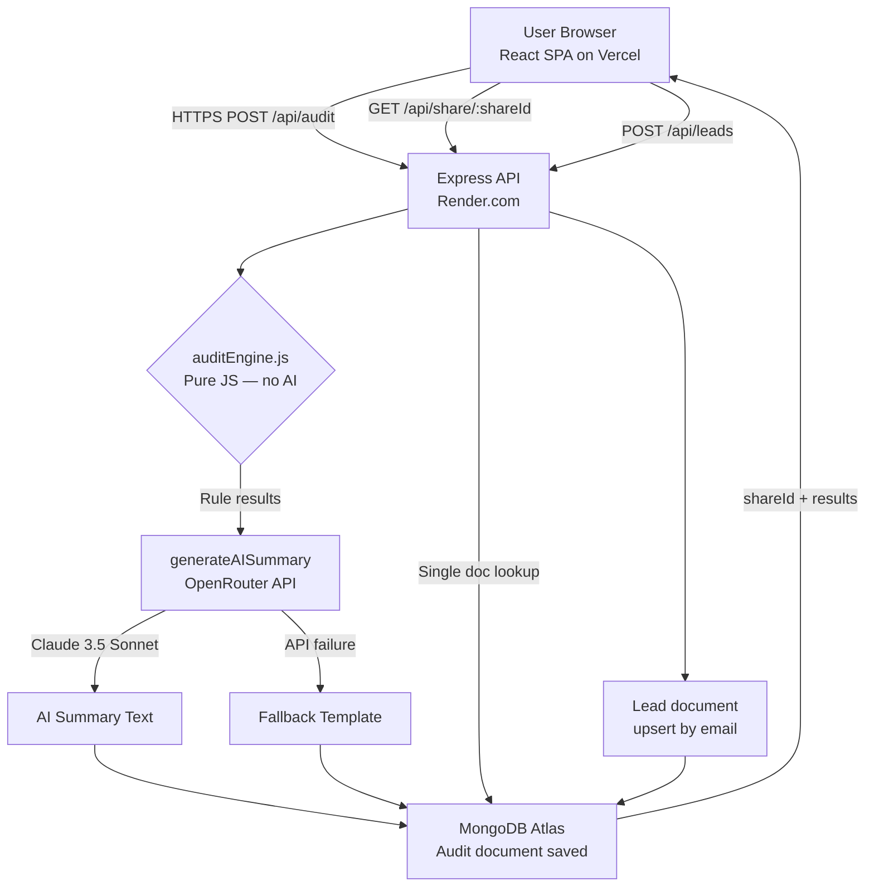

# ARCHITECTURE.md — StackSpend

## System Diagram



---

## Data Flow: From User Input to Audit Result

```
1. USER fills 3-step form
      tools[]        { toolId, planKey, seats, monthlySpend }
      teamSize       integer
      primaryUseCase coding | writing | research | data | mixed

2. POST /api/audit
      → Middleware: rate-limit (100 req/15min), helmet, CORS
      → auditController.runAudit()

3. auditEngine.runAudit(input)   ← PURE FUNCTION, no I/O
      a. getEffectiveCost()      maps each tool entry → monthly $
      b. Per-tool rules (9)      fire against individual entries
      c. Cross-tool rules (2)    fire against full tools[] array
      d. Deduplication           keep highest-savings rec per toolId
      e. Totals                  sum monthlySavings, yearlySavings, %

4. generateAISummary(auditResult)
      → builds prompt with structured audit data
      → calls OpenRouter (Claude 3.5 Sonnet, temp=0.4, max_tokens=800)
      → falls back to deterministic template on any failure

5. Audit.create()
      → MongoDB insert: { shareId, tools, recommendations, aiSummary, ... }
      → TTL index: auto-expire after 90 days

6. Response → Zustand store → ResultsPage renders
      → shareId in URL for sharing
```

---

## Frontend Architecture

### State Management (Zustand)

```
auditStore
  ├── form (persisted to localStorage)
  │     ├── tools[]     { toolId, planKey, seats, monthlySpend }
  │     ├── teamSize
  │     └── primaryUseCase
  └── result (ephemeral — not persisted)
        ├── recommendations[]
        ├── totalMonthlySavings
        ├── totalYearlySavings
        ├── savingsPercentage
        ├── aiSummary
        └── shareId
```

**Why Zustand?** Zero boilerplate, React Suspense friendly, built-in `persist` middleware. For our state surface area, Redux would add ~4 files of ceremony with no additional benefit.

### Routing (React Router v7)

| Path | Component | Description |
|---|---|---|
| `/` | LandingPage | Marketing + CTA |
| `/audit` | AuditFormPage | 3-step tool selector form |
| `/results/:shareId` | ResultsPage | Fresh audit results |
| `/share/:shareId` | SharedPage → ResultsPage | Public read-only view |

---

## Backend Architecture

### Layered Design

```
HTTP Request
  → Express Router
    → Middleware (rate-limit · helmet · cors · json-size-limit)
      → Controller (validate · orchestrate)
        → auditEngine (pure function — zero side effects)
        → aiSummary service (external call · has fallback)
        → Mongoose Models (DB write)
  → HTTP Response
```

### Audit Engine Design (`auditEngine.js`)

The engine is a **pure utility function** — deterministic, no side effects, no DB or network calls.

```
runAudit(input) → auditResult

Rule categories:
  Per-tool rules (9):
    ruleChatGPTTeamSmallTeam
    ruleChatGPTEnterpriseSmallTeam
    ruleGitHubCopilotEnterpriseSmall
    ruleClaudeProForCoding
    ruleOpenAIApiHighSpend
    ruleAnthropicApiHighSpend
    ruleCursorBusinessSolo
    ruleWindsurfTeamsSmall
    ruleGeminiEnterpriseSmall

  Cross-tool rules (2):
    ruleDuplicateCodingTools   (cursor + copilot + windsurf overlap)
    ruleDuplicateAssistants    (chatgpt + claude + gemini overlap)

  Post-processing:
    Deduplication by toolId (highest savings wins)
    Totals aggregation
    Sort by monthlySavings DESC
```

**Why deterministic?** Finance recommendations must be auditable. The same input must always produce the same output — no hallucinations, no randomness.

### MongoDB Schemas

**Audit**
- `shareId` — unique 12-char nanoid, indexed
- `tools[]` — tool entries as subdocuments
- `recommendations[]` — embedded (no separate collection needed for our read pattern)
- `aiSummary` — cached string, served on share views without re-calling AI
- TTL index: auto-expires after 90 days

**Lead**
- Unique index on `email` — prevents duplicate capture
- Upsert strategy (idempotent) — re-submission updates metadata

---

## Stack Rationale

| Choice | Alternatives Considered | Reason |
|---|---|---|
| Express.js | Fastify, NestJS | Minimal setup for a single-purpose API; NestJS is overkill |
| MongoDB | PostgreSQL, SQLite | Audit documents embed naturally; no JOIN complexity on reads |
| Zustand | Redux, React Context | Zero boilerplate for our state surface; `persist` middleware built-in |
| Vite + React | Next.js, Remix | Pure SPA is sufficient; no SSR needed for audit tool; faster DX |
| OpenRouter | Direct Anthropic API | Model flexibility; free-tier model availability for dev/testing |
| Nanoid (12-char) | UUID | Shorter, URL-safe, no collision risk at our scale |

---

## Security Model

| Concern | Mitigation |
|---|---|
| XSS | Helmet sets CSP headers |
| CORS | Explicit origin whitelist via `FRONTEND_URL` env var |
| Rate abuse | Global: 100 req/15min; AI endpoint: 20 req/hr per IP |
| Data exposure | Share endpoint strips `ipHash` and `leadEmail` fields |
| Payload injection | `express.json({ limit: '10kb' })` rejects oversized bodies |
| IP tracking | SHA-256 hash (non-reversible), stored as 16-char prefix only |

---

## What I'd Change at 10,000 Audits/Day

At ~417 audits/hour (7/min), the current architecture hits two bottlenecks:

| Bottleneck | Current Approach | Scale Fix |
|---|---|---|
| Rate limiter | In-memory (single process) | **Redis-backed** `rate-limit-redis` — survives restarts and horizontal scale |
| AI summaries | Synchronous per-request | **Queue + worker** (BullMQ + Redis) — decouple from HTTP response, retry on failure |
| MongoDB | M0 free cluster (shared) | **Atlas M10 dedicated** cluster (~$57/mo) + read replicas for share endpoint |
| API server | Single Render instance | **Horizontal scaling** — Render auto-scale or migrate to Railway/Fly.io |
| Pricing data | Hardcoded JS object | **Monthly cron job** to scrape/validate vendor pricing pages + alert on drift |

The audit engine itself scales horizontally with zero changes — it's stateless and in-process.
