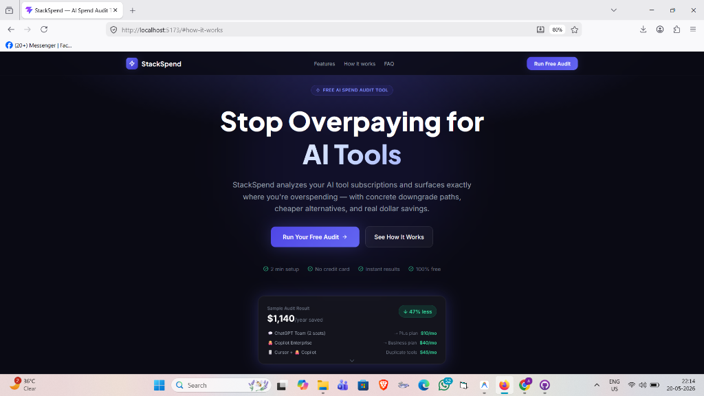
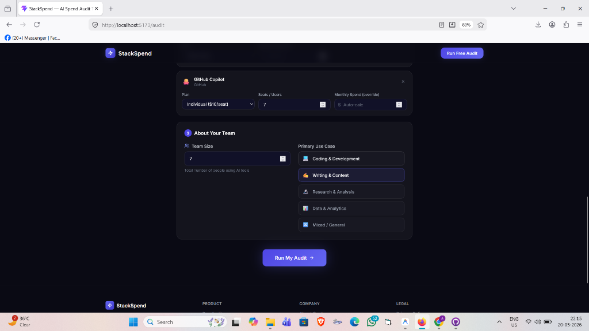
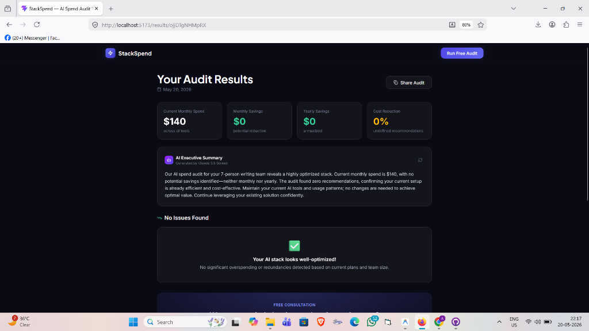

# StackSpend — AI Spend Audit Tool

> **Find out exactly how much you're overpaying for AI tools. Free. Instant. Finance-reasoned.**

[](https://github.com/your-org/stackspend/actions)

StackSpend is a free MERN-stack web app that audits your team's AI tool subscriptions and surfaces real, dollar-denominated savings — built for CTOs, engineering leads, and finance teams who suspect they're overpaying but haven't had time to check.

**Deployed:** [https://stackspend.vercel.app](https://stackspend.vercel.app)

---

## Screenshots

> **Landing Page**
> 
>
> **Audit Form — Configure Team & Tools**
> 
>
> **Results Page — Savings Breakdown**
> 


---

## Supported Tools

| Tool | Plans |
|---|---|
| ChatGPT | Free, Plus ($20), Team ($25), Enterprise ($60) |
| Claude | Free, Pro ($20), Team ($25), Enterprise ($50) |
| Gemini | Free, Advanced ($19.99), Business ($24), Enterprise ($30) |
| Cursor | Free, Pro ($20), Business ($40) |
| GitHub Copilot | Free, Individual ($10), Business ($19), Enterprise ($39) |
| Windsurf | Free, Pro ($15), Teams ($30) |
| OpenAI API | Pay-as-you-go |
| Anthropic API | Pay-as-you-go |

---

## Quick Start

### Prerequisites

- Node.js ≥ 18
- MongoDB Atlas account (free tier works)
- OpenRouter API key (optional — fallback summary works without it)

### Backend

```bash
cd backend
cp .env.example .env
# Fill in MONGODB_URI and optionally OPENROUTER_API_KEY
npm install
npm run dev        # starts on :5000
```

### Frontend

```bash
cd frontend
cp .env.example .env
# Set VITE_API_URL=http://localhost:5000/api
npm install
npm run dev        # starts on :5173
```

### Run Tests

```bash
cd backend
npm test
```

### Environment Variables

**Backend (`backend/.env`)**

| Variable | Required | Description |
|---|---|---|
| `MONGODB_URI` | ✅ | MongoDB Atlas connection string |
| `OPENROUTER_API_KEY` | Optional | For AI executive summaries |
| `FRONTEND_URL` | ✅ | CORS allowed origin (e.g., `http://localhost:5173`) |
| `PORT` | No | Defaults to `5000` |

**Frontend (`frontend/.env`)**

| Variable | Required | Description |
|---|---|---|
| `VITE_API_URL` | ✅ | Backend API base URL |

### Deploy

**Frontend → Vercel**
1. Connect repo → select `frontend/` as root directory
2. Set `VITE_API_URL` in Vercel environment settings
3. Deploy

**Backend → Render**
1. New Web Service → select `backend/` as root
2. Build: `npm install` · Start: `npm start`
3. Add all env vars from `.env.example`

---

## Tech Stack

| Layer | Technology |
|---|---|
| Frontend | React 19, Vite, Tailwind CSS v4, Framer Motion, Recharts |
| State | Zustand (with localStorage persistence) |
| Routing | React Router v7 |
| Backend | Node.js, Express.js |
| Database | MongoDB Atlas + Mongoose |
| AI | OpenRouter API → Claude 3.5 Sonnet (with fallback) |
| Security | Helmet, CORS, express-rate-limit |
| Tests | Jest (16 test cases) |
| CI/CD | GitHub Actions |
| Deploy | Vercel (frontend) + Render (backend) |

---

## Decisions

### 1. Deterministic rule engine — not pure AI
**Trade-off:** Could have used an LLM to generate recommendations end-to-end.
**Why we didn't:** Finance recommendations must be reproducible and auditable. A CFO sharing the report with their board needs to trust the numbers weren't hallucinated. The audit engine is pure JavaScript — no randomness, no external calls. AI is used only for the executive summary prose, where variance is acceptable.

### 2. Zustand over Redux
**Trade-off:** Redux has a larger ecosystem and DevTools are more mature.
**Why Zustand:** Zero boilerplate for this scale of app. The `persist` middleware gave us localStorage sync in 2 lines. Redux would have added 3–4 files of ceremony for the same result. At our state complexity, Redux is infrastructure cost with no ROI.

### 3. MongoDB over PostgreSQL
**Trade-off:** Relational structure (tools, plans, recs) would model naturally in SQL with proper foreign keys.
**Why MongoDB:** Audit results embed naturally as nested documents — no JOINs needed on the read path. The free Atlas tier is generous. Recommendations are stored as embedded arrays, making the share-link read a single document fetch.

### 4. Fallback AI summary — never block the result
**Trade-off:** Showing a template fallback is less impressive than a real LLM output.
**Why:** A failed AI call must never prevent the user from seeing their audit results. The fallback uses the same structured data and produces a serviceable, finance-accurate summary. Reliability > polish.

### 5. Anonymous audits with TTL expiry — no auth required
**Trade-off:** Without user accounts, we can't do audit history, team sharing, or repeat comparison.
**Why:** The fastest path to value for the user is zero friction. No signup = more completions = more leads. MongoDB TTL index auto-expires audits after 90 days, keeping data minimal and GDPR-friendly. Auth can be added in week 2.

---

## API Reference

### `POST /api/audit`
Run a full audit.

```json
{
  "tools": [
    { "toolId": "chatgpt", "planKey": "team", "seats": 3 },
    { "toolId": "cursor",  "planKey": "business", "seats": 3 }
  ],
  "teamSize": 3,
  "primaryUseCase": "coding"
}
```

**Response:** `{ success, data: { shareId, recommendations, totalMonthlySavings, aiSummary, ... } }`

### `GET /api/share/:shareId`
Fetch a public audit by share ID (sanitized — no IP or email data).

### `POST /api/leads`
Capture a consultation lead.

### `POST /api/audit/summary`
Regenerate AI summary (rate-limited: 20/hr per IP).

---

## License
MIT — built for Credex
